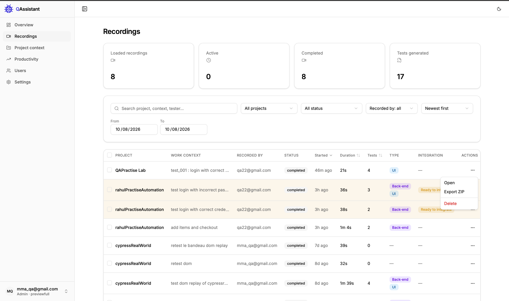
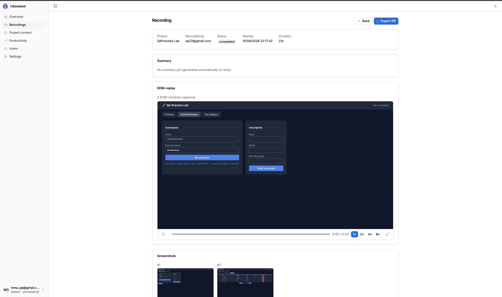
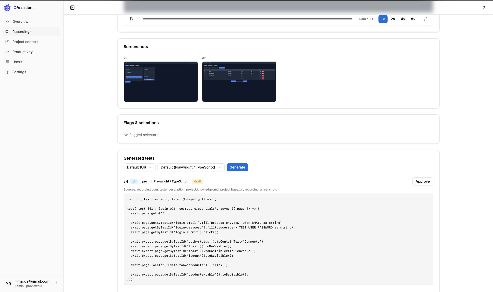
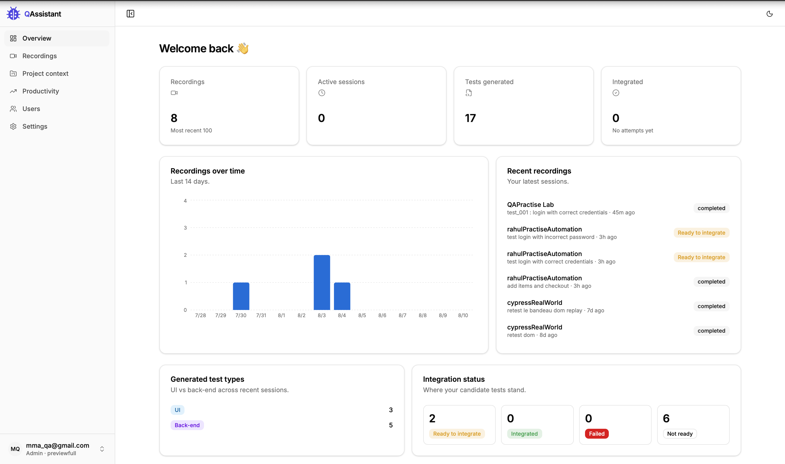
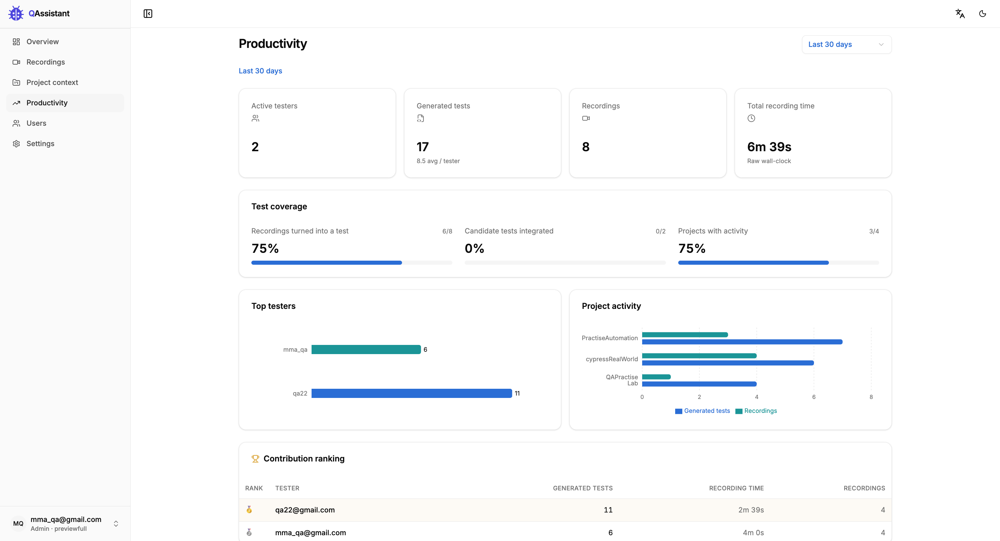
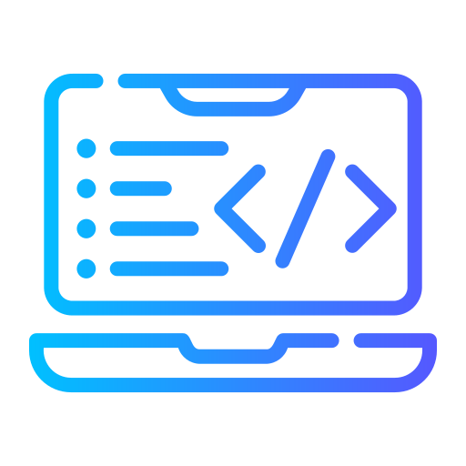
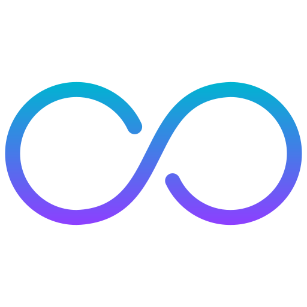

<div align="center">

<picture>
  <source media="(prefers-color-scheme: dark)" srcset="docs/qa-managers/images/logo-dark.svg">
  
</picture>

**Capitalisez sur les tests manuels de votre équipe, gagnez en couverture et pilotez la productivité de vos testeurs.**


[](LICENSE)


</div>

## Le problème

<div align="center">
<table>
<tr>
<td align="center" width="150"><br><b>Tests manuels</b></td>
<td align="center" width="60"></td>
<td align="center" width="150"><br><b>Répétés</b></td>
<td align="center" width="60"></td>
<td align="center" width="150"><br><b>Perdus</b></td>
</tr>
</table>
</div>

<div align="center">

❌ **Tests manuels répétés. Expertise perdue.**

</div>

## La solution QAssistant

QAssistant part d'un principe simple. Le test manuel de votre équipe ne doit pas se perdre,
il faut **capitaliser sur** cet effort. Chaque session est capturée, puis transformée en test
automatisé réutilisable, et vient enrichir une batterie de tests qui grandit à chaque
campagne, sans budget dédié ni chantier d'automatisation à part.

**Ce que vous y gagnez**

- 🔄 **Un capital technique :** une batterie de tests automatisés qui s'enrichit à chaque campagne, sans budget dédié ni chantier à part.
- 👁️ **Une visibilité en temps réel :** un suivi de l'activité et de la productivité de votre équipe.
- 🛑 **Aucune difficulté perdue :** un blocage rencontré par un testeur est capturé dans la session, donc visible par le manager et rejouable à volonté.
- 👥 **Un vrai pilotage :** une vue par rôle pour mesurer l'avancement et analyser les succès comme les échecs.

## Aperçu

Du parcours enregistré au test automatisé approuvé. Cliquez sur une image pour l'agrandir.

<table>
  <tr>
    <td width="50%" align="center">
      <a href="docs/qa-managers/images/02-recordings.png"></a>
      <br><sub><b>Toutes les sessions enregistrées</b></sub>
    </td>
    <td width="50%" align="center">
      <a href="docs/qa-managers/images/03-session-detail.png"></a>
      <br><sub><b>Détail d'une session : replay, captures, réseau, signalements</b></sub>
    </td>
  </tr>
  <tr>
    <td width="50%" align="center">
      <a href="docs/qa-managers/images/04-generated-test.png"></a>
      <br><sub><b>Test automatisé généré par l'IA</b></sub>
    </td>
    <td width="50%" align="center">
      <a href="docs/qa-managers/images/01-overview.png"></a>
      <br><sub><b>Vue d'ensemble par rôle</b></sub>
    </td>
  </tr>
  <tr>
    <td colspan="2" align="center">
      <a href="docs/qa-managers/images/05-productivity.png"></a>
      <br><sub><b>Page Productivité (managers)</b></sub>
    </td>
  </tr>
</table>

## Fonctionnement

Le manager pose le cadre, le testeur capitalise sur son travail. Personne n'écrit de code.

 **Côté QA manager**

- 📁 Crée le projet et son contexte
-  Suit la productivité et l'activité de l'équipe

 **Côté testeur**

-  Enregistre son scénario (DOM, réseau, captures, flags)
-  Cadre la génération (framework, langage, UI ou API)
-  Génère le test avec l'agent IA, régénère jusqu'à la bonne version
-  Approuve la version retenue
-  Intègre au dépôt via MCP, seulement si le test s'exécute avec succès

## Accès

### En ligne (Cloud)

QAssistant est **gratuit** et hébergé sur **https://qassistant.app/**. Contactez-moi et je vous envoie un **lien d'inscription
personnalisé** pour créer votre organisation.

### En local

Pour développer QAssistant ou l'essayer sans l'instance hébergée. C'est un monorepo npm
workspaces, en TypeScript de bout en bout, Node 20 et plus, adossé à docker-compose.

Prérequis : Node 20 (`.nvmrc`) et Docker.

```bash
npm install
cp .env.example .env

# 1) Postgres + MinIO
npm run dev:infra

# 2) Charger l'env dans CE shell (l'app lit process.env directement, pas de dotenv).
set -a; . ./.env; set +a          # ou lancez chaque commande avec `node --env-file=.env`

# 3) Backend
npm run db:migrate -w @qassistant/api
npm run seed:super-admin -w @qassistant/api    # premier super-admin (aucun parcours UI)
npm run start:dev -w @qassistant/api           # API sur http://127.0.0.1:8080 (/api/v1)

# 4) Dashboard (nouveau terminal, relancez d'abord la ligne `set -a; . ./.env; set +a`)
VITE_API_PROXY_TARGET=http://127.0.0.1:8080 \
  npm run dev -w @qassistant/dashboard         # http://localhost:5173, proxifie /api vers :8080

# 5) Extension (Chrome MV3). Compilez-la en visant votre API LOCALE, puis chargez-la.
#    Sans VITE_API_BASE_URL, la compilation vise l'instance hébergée, pas localhost.
VITE_API_BASE_URL=http://127.0.0.1:8080 npm run build -w @qassistant/extension
# chrome://extensions -> Mode développeur -> Charger l'extension non empaquetée -> apps/extension/dist
```

Les drivers hors ligne (`STORAGE_DRIVER=local`, `SECRETS_DRIVER=local`,
`CLOUD_TASKS_DRIVER=inline`, et un client IA factice quand `GEMINI_API_KEY` est vide) n'ont
besoin de rien d'autre que Postgres. Notes par application :
[`apps/api`](apps/api/README.md), [`apps/dashboard`](apps/dashboard/README.md),
[`apps/extension`](apps/extension/README.md), [`apps/mcp`](apps/mcp/README.md).

## Structure du dépôt

```text
apps/api/          API back-end NestJS (Drizzle + PostgreSQL row-level security)
apps/dashboard/    Tableau de bord React + Vite (l'app web où vous vous connectez)
apps/extension/    Extension Chrome MV3 (capture rrweb) utilisée pour enregistrer les sessions
apps/mcp/          Serveur MCP : expose les enregistrements et les tests générés aux clients IA,
                   consigne les résultats d'intégration (ne pousse jamais sur Git lui-même)
packages/shared/   Schémas zod, enums et types TypeScript partagés
infra/             Dockerfiles, Caddyfile, docker-compose, et bootstrap/deploy/backup du VPS
openspec/          Spécifications, conception et historique des changements (source de vérité)
docs/              Politique de confidentialité et notes de capture/replay
```

## Architecture

Monorepo **TypeScript** de bout en bout (API, dashboard, extension, schémas partagés).

- **Back-end** NestJS et **PostgreSQL** avec **row-level security** par `tenantId` pour isoler chaque organisation. Artefacts sur **MinIO** (S3).
- **Auth** maison email et mot de passe : jetons opaques en base (argon2id), accès 2 h et refresh 30 j révocables, pas d'inscription libre.
- **Génération de tests** via l'API **Gemini**, file de jobs sur Postgres avec worker in-process (pas de Redis). Intégration au dépôt confiée à un client IA via **MCP**.
- **Infra** : Docker Compose sur un VPS, reverse proxy **Caddy** avec HTTPS automatique, **CI/CD GitHub Actions**.

## Confidentialité

Pour ce qui est capturé, le masquage, la conservation et la suppression, voyez
[`docs/PRIVACY.md`](docs/PRIVACY.md).
